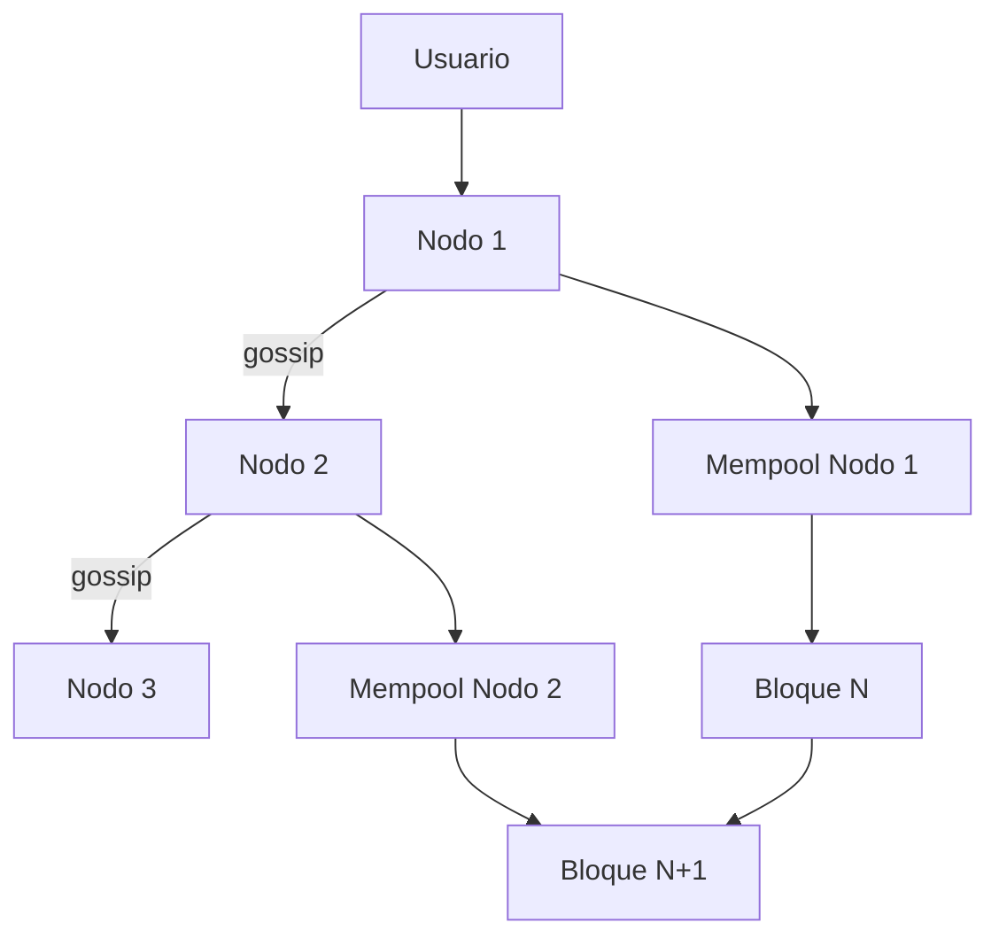

# 🌐 Blockchain: Confianza Digital Descentralizada  

Landing page **moderna e informativa** sobre **tecnología Blockchain**, desarrollada en **HTML, CSS y JavaScript puro**, con enfoque en diseño atractivo, interacción y fundamentos educativos.  

---

## 📌 Descripción  
Este proyecto es una página web tipo **Landing Page** que explica de forma interactiva y visual los conceptos clave de Blockchain:  
- Fundamentos técnicos (hash, bloques, criptografía).  
- Objetivo de la descentralización y confianza digital.  
- Principales antecedentes (PoW, criptografía de clave pública, problema bizantino).  
- Casos de uso (Criptomonedas, NFT, contratos inteligentes, identidad digital, sector público).  
- Diferencia entre minería PoW y PoS.  
- Animación visual sobre cómo funciona una red blockchain.  

---

## 🛠️ Tecnologías utilizadas
- **HTML5** → estructura semántica de la landing.  
- **CSS3 (modern design)**:  
  - Variables CSS (`:root`) para colores y efectos.  
  - Glassmorphism + gradientes radiales 🎨.  
  - Responsive design con **media queries**.  
  - Animaciones (`fade-in`, `pulse`).  
- **JavaScript Vanilla (ES6)**:  
  - IntersectionObserver para animaciones al hacer scroll.  
  - Generador dinámico de año en el footer.  
  - Animación ASCII interactiva de la red blockchain.  

---

## 📐 Estructura de la página
- **Navbar fija** con navegación interna.  
- **Hero Section**:  
  - Título, subtítulo, CTA (`Explorar fundamentos`).  
  - Badges de valores clave: **Inmutabilidad, Descentralización, Verificabilidad**.  
  - Visual Blockchain con bloques encadenados.  
- **Secciones temáticas**:  
  1. Qué es Blockchain y sus objetivos.  
  2. Antecedentes técnicos.  
  3. Fundamentos (criptografía, hash, bloques, consenso).  
  4. Diagrama interactivo de una red blockchain.  
  5. Casos de uso reales.  
  6. Criptomonedas.  
  7. Minería (PoW & PoS).  
- **Footer dinámico** con créditos.  

---

## 🎨 Capturas simuladas
**Hero Section**  
```
+--------------------------------------------------------+
| 🚀 "Blockchain es la arquitectura idónea..."           |
| Inmutabilidad | Descentralización | Verificabilidad    |
| CTA: [Explorar fundamentos] [Ver red en acción]        |
+--------------------------------------------------------+
```

**Diagrama interactivo ASCII animado**  
```
[Usuario] --> [Nodo 1] === gossip === [Nodo 2] === gossip === [Nodo 3]
            ↓                                     ↓
         [Mempool]                            [Mempool]
```

---

## 📊 Diagrama de Componentes


---

## 📱 Responsive Design
- Pantallas grandes → diseño en **grids de 2-3 columnas**.  
- Pantallas pequeñas (<980px) → contenido apilado en **1 sola columna**.  

---

## 🚀 Instalación y ejecución
1. Clonar el repositorio  
   ```bash
   git clone https://github.com/usuario/blockchain-landing.git
   ```
2. Entrar al directorio  
   ```bash
   cd blockchain-landing
   ```
3. Abrir el archivo `index.html` en tu navegador  

No requiere dependencias externas ni servidores adicionales ✨.  

---

## 🔮 Futuras mejoras
- 🌗 Modo oscuro/claro automático.  
- 📊 Diagramas con **Mermaid.js** o **SVG animados**.  
- 🌐 Multi-idioma (ES/EN).  
- 📈 Integrar métricas de visitas (Google Analytics o Plausible).  

---

## 👤 Autor
**Andres Giovanny Vasco**  
📅 © 2025  

---

💡 Este proyecto busca **difundir el conocimiento sobre Blockchain** con una landing moderna y educativa.  
